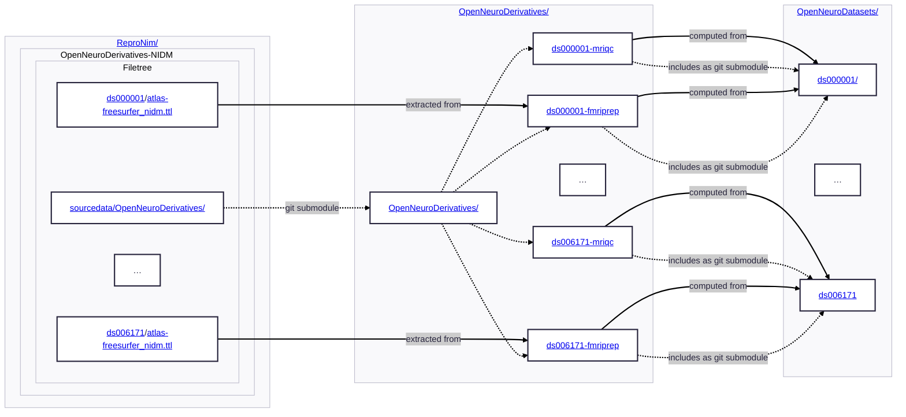

# OpenNeuroDerivatives-NIDM

Our experimentation on extracting NIDM descriptors for all OpenNeuroDerivatives datasets which were
already made available.

Initial work was to perform the NIDMification of the FreeSurfer derivitives, 
using [segstats_jsonld](https://github.com/ReproNim/segstats_jsonld) on all FreeSurfer content indexed in
the [OpenNeuroDerivatives](https://github.com/OpenNeuroDerivatives) repo.

Here is a diagram which provides high level depiction of composition and *data dependnencies* (see [YODA](https://github.com/myyoda/myyoda)):



## Setup

You can clone this repository and then if you would like to access annexed
content, ATM you would need to add typhon server as a remote:

```shell

git clone https://github.com/ReproNim/OpenNeuroDerivatives-NIDM
cd OpenNeuroDerivatives-NIDM
git remote add --fetch typhon typhon:/data/repronim/OpenNeuroDerivatives-NIDM
```

For setting up typhon ssh access, see [CON/boarding document](https://github.com/con/catenate/blob/main/conboarding.md#cons-development-boxes).
