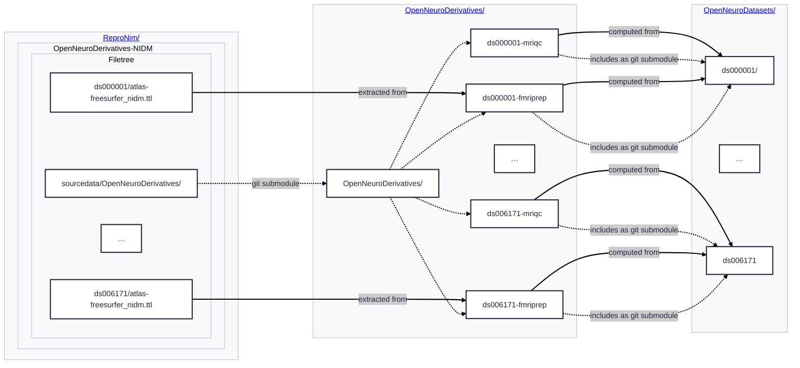

# OpenNeuroDerivatives-NIDM

Our experimentation on extracting NIDM descriptors for all OpenNeuroDerivatives datasets which were
already made available.

Initial work was to perform the NIDMification of the FreeSurfer derivitives, 
using [segstats_jsonld](https://github.com/ReproNim/segstats_jsonld) on all FreeSurfer content indexed in
the [OpenNeuroDerivatives](https://github.com/OpenNeuroDerivatives) repo.

Here is a diagram which provides high level depiction of composition and *data dependnencies* (see [YODA](https://github.com/myyoda/myyoda)):

